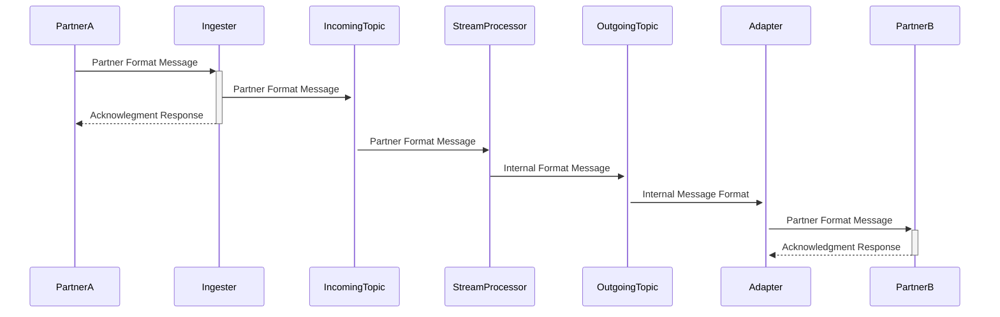
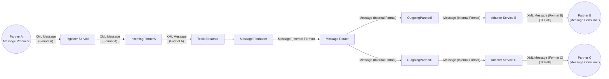

# POC Architecture -- Simplified Messaging Flow (XML & JSON Support)

This document describes a **minimal Proof-of-Concept (POC)**
implementation showing how messages flow from a simulated
partner---sending either **XML or JSON**---through an ingestion + Kafka
streaming pipeline, to an adapter service, and finally to a partner
simulator via TCP/IP.

The goal is **NOT** to reflect the final production architecture, but to
validate message flow, transformation, routing, and offset handling.

------------------------------------------------------------------------

# 1. POC Scope Overview

The POC includes **only the following components**:

-   **Message Producer (Partner Simulator -- Client Side)**\
    Sends XML **or JSON** messages via a REST endpoint.

-   **Ingestor + Kafka Stream Processor (Single Spring Boot Service)**

    -   Receives XML/JSON via REST
    -   Publishes raw payload into **input-topic**
    -   Kafka Stream API reads from input-topic
    -   Applies filter logic and routes to **output-topic-A** and
        **output-topic-B**

-   **Adapter Service (Spring Boot)**

    -   Consumes from output-topic-A and output-topic-B\
    -   Opens TCP/IP connection to **Partner Simulator (Server Side)**\
    -   Sends raw XML or JSON\
    -   Commits Kafka offsets **only after successful TCP/IP
        transmission**

-   **Partner Simulator (Server Side)**

    -   Accepts TCP/IP connections
    -   Receives XML or JSON pushed by Adapter Service

-   **Monitoring/Diagnostic Tools**

    -   Monitors, and easily create topics and produces messages via Docker.
    -   Uses KafkaUI

------------------------------------------------------------------------

# 2. High-Level POC Architecture

    Partner Simulator (Client)
            |
            |  REST (XML or JSON)
            v
    ---------------------------------
        Ingestor + Kafka Streams
    ---------------------------------
            |
            | Kafka input-topic
            v
      Kafka Stream Filter Logic
            |
            |--> output-topic-A
            |--> output-topic-B
            v
    ---------------------------------
             Adapter Service
    ---------------------------------
            |
            | TCP/IP (XML or JSON)
            v
     Partner Simulator (Server)

------------------------------------------------------------------------

# 3. Component Breakdown

## 3.1 Message Producer (Partner Simulator -- Client)

-   Sends **XML or JSON** payloads to **POST /ingest/data**
-   Simple script or application for generating test messages.

------------------------------------------------------------------------

## 3.2 Ingestor + Kafka Stream Processor (Single Spring Boot Service)

### Responsibilities

-   Accept XML or JSON via REST.
-   Perform no transformations (treat as opaque payload).
-   Publish payload to **input-topic**.
-   Kafka Stream API applies routing/filter logic.
-   Outputs routed to:
    -   **output-topic-A**
    -   **output-topic-B**

### Notes

-   XML/JSON treated as raw string for POC.
-   One Spring Boot application for ingestion and Kafka Streams.

------------------------------------------------------------------------

## 3.3 Adapter Service

### Responsibilities

-   Consume messages from output-topic-A and output-topic-B.
-   Open TCP/IP connection to partner simulator.
-   Push raw XML or JSON data.
-   Commit Kafka offsets **only after the payload is successfully
    transmitted**.

### Additional Concept Needed

-   Manual offset commit strategy for exactly-once or at-least-once
    behavior.

------------------------------------------------------------------------

## 3.4 Partner Simulator (Server)

-   Simple TCP/IP server.
-   Logs received XML or JSON for verification.

------------------------------------------------------------------------

# 4. Message Flow (POC Version)

### Step 1: Partner → REST

Partner Simulator (Client) posts **XML or JSON** to the Ingestor REST
endpoint.

### Step 2: REST → Kafka

Ingestor publishes raw payload to **input-topic**.

### Step 3: Kafka Stream Processing

Stream Processor routes messages based on POC filter logic: -
output-topic-A - output-topic-B

### Step 4: Adapter Service

Adapter sends the XML/JSON payload over TCP/IP and commits offsets on
success.

### Step 5: Partner Simulator (Server)

Receives and logs XML/JSON packets.

## 4.1 Sequence Diagram

## 4.2 Message Flowchart

------------------------------------------------------------------------
# 5. Project Skeleton

Containerization: Docker

Messaging: 
  - Kafka 
  - *Zookeeper
  - Kafka-UI

Application:
  - Runtime: Java 21
  - Build: Maven

## DataHub

- datahub/
  - common/
    - entity/
      - Message.java
    - config/
	     - KafkaAdminConfig.java
	     - KafkaProducerConfig.java
  - ingester/
    - interfaces/
      - api/
        - IngestController.java
    - producer/
      - IncomingMessageProducer.java
  - processor/
    - service/
      - StreamProcessor.java
      - MessageFilter.java
      - MessageFormatter.java
      - MessageRouter.java
  - IngesterProcessorApplication.java

Dependencies:
- SpringBoot
- Spring Web
- Kafka
- Kafka Streams
- Jackson
- Lombok

## Adapter

- adapter/
  - common/
    - config/
      - KafkaConsumerConfig.java
  - interfaces/
    - AdapterServer.java
  - consumer/
      - OutgoingMessageConsumer.java
  - AdapterApplication.java

Dependencies:
SpringBoot
Kafka
Jackson
Lombok

## Testing

### End-to-End Simulation
Partner Producer Simulator
- Java/Python/Shell script to produce messages and send to ingester via RestAPI

Partner Consumer Simulator
- Java/Python/Shell script that will connect as a client to Adapter application via TCP/IP

    
------------------------------------------------------------------------

# 6. Out of Scope (POC)

Excluded from the POC:

-   Databases
-   ActiveMQ
-   Tibco EMS
-   SFTP ingestion
-   Canonical schemas
-   Security/Auth
-   Multi-partner orchestration
-   Message persistence
-   Replay/backpressure
-   Acknowledgment loops

------------------------------------------------------------------------

# 7. Summary

This POC validates the core integration pipeline supporting **both XML
and JSON**:

-   Accept XML/JSON
-   Publish to Kafka
-   Route with Kafka Streams
-   Deliver over TCP/IP
-   Commit offsets only on success

This ensures a working foundation before expanding the architecture
further.
